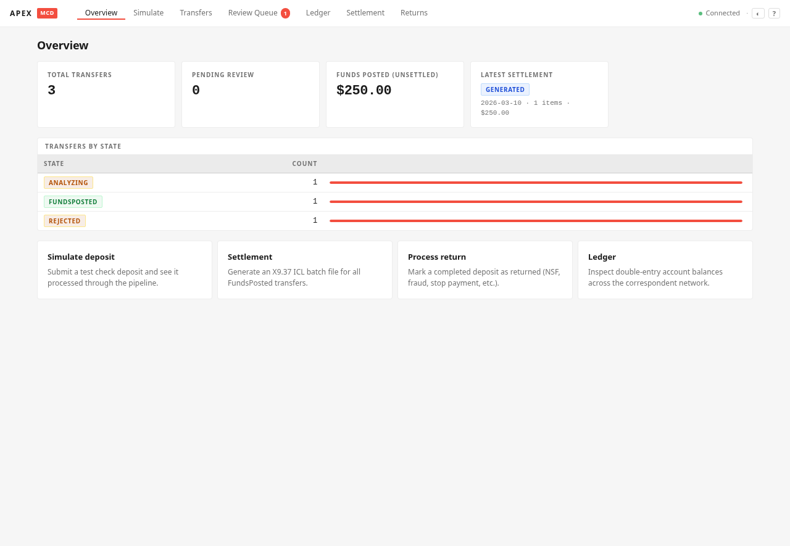
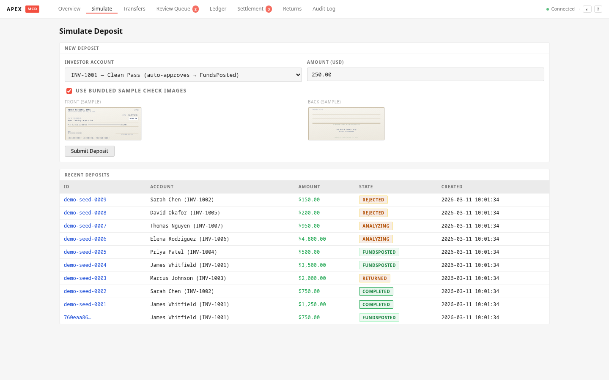
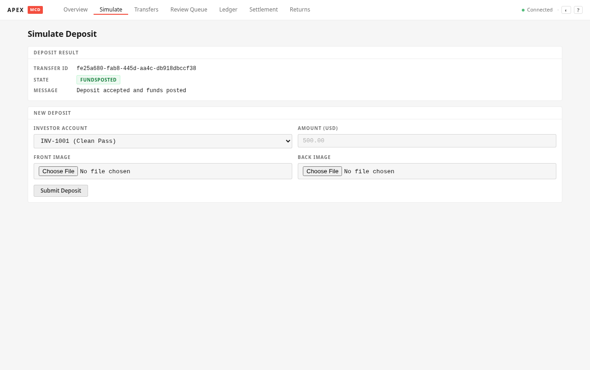
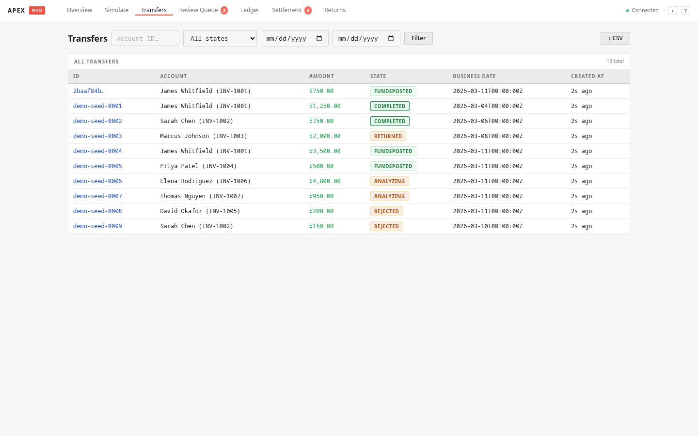
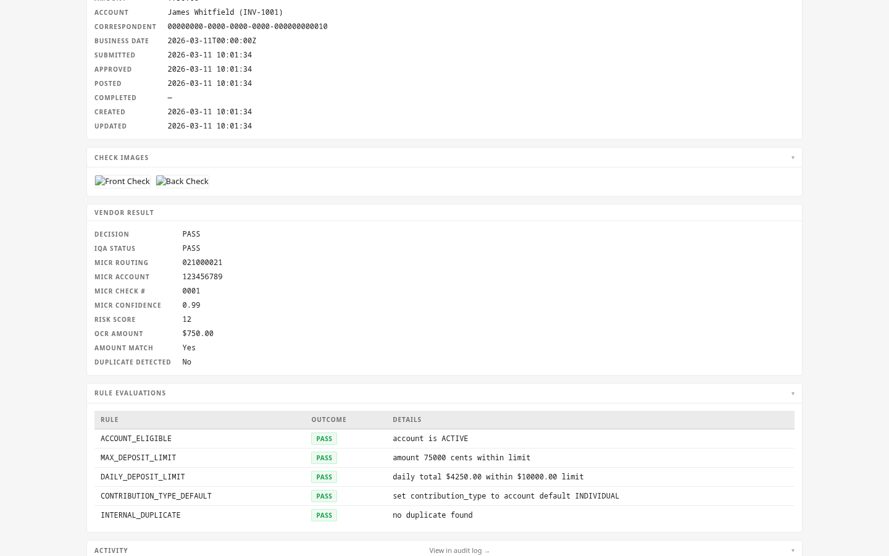
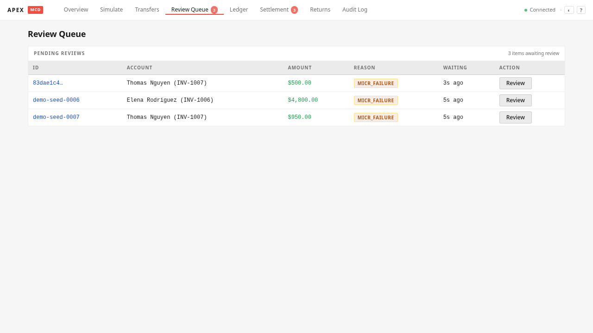
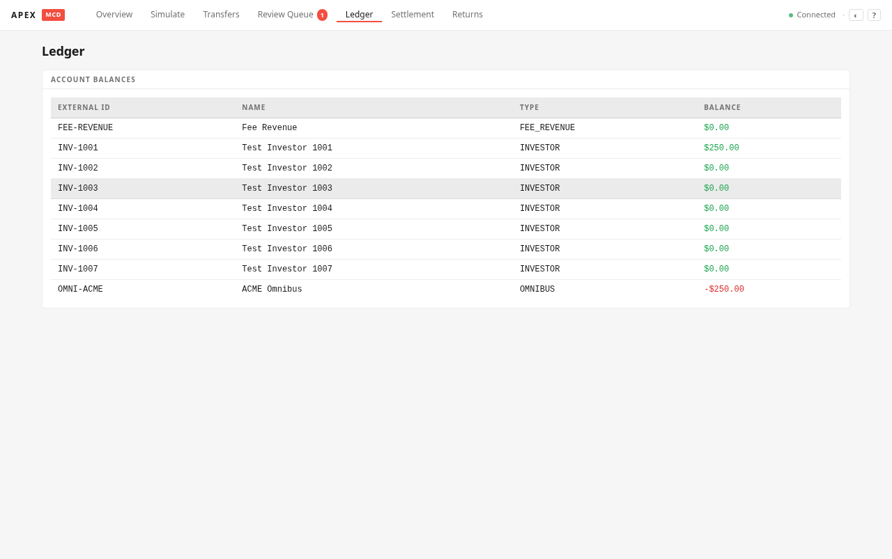
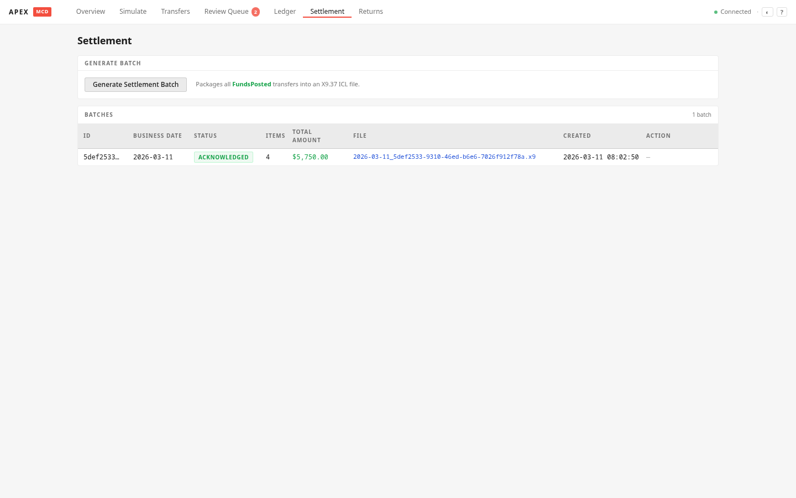
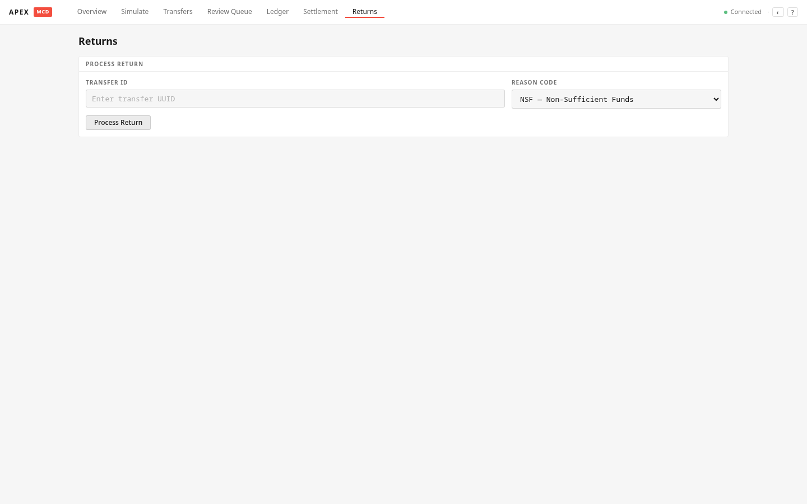
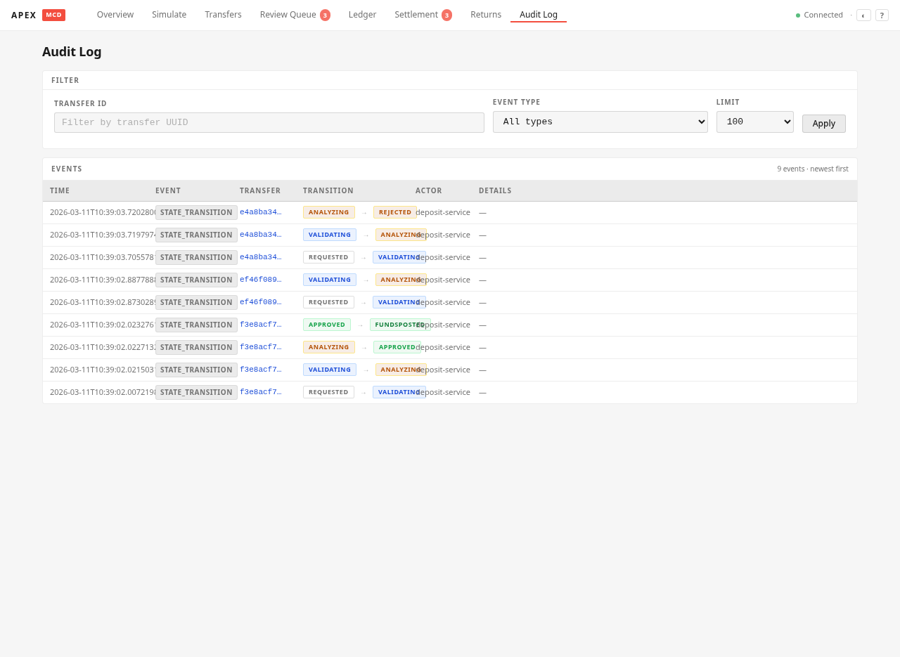

# Mobile Check Deposit System

A minimal end-to-end mobile check deposit system for brokerage accounts. Investors submit check images, which flow through vendor validation, business rule enforcement, operator review, ledger posting, settlement, and return/reversal handling.

## Quick Start

```bash
cp .env.example .env
make dev
# App:         http://localhost:8080
# Vendor Stub: http://localhost:8081
```

`make dev` starts both the vendor stub and the main application server. The SQLite database and seed data are created automatically on first run.

### Other Commands

| Command         | Description                                                              |
|-----------------|--------------------------------------------------------------------------|
| `make test`     | Run all Go unit/integration tests                                        |
| `make test-e2e` | Run Playwright end-to-end tests                                          |
| `make demo`     | Run all-scenarios demo (starts servers, exercises all paths, tears down) |
| `make demo-video` | Generate 3-minute professional demo video (4 workflows, visual QA checks) |
| `make reset`    | Delete database, images, and settlement files                            |
| `make build`    | Build both binaries to `bin/`                                            |
| `make clean`    | Remove all generated artifacts                                           |

## Architecture

```
┌─────────────────┐       ┌──────────────────┐
│  Web UI (HTMX)  │       │  REST API (chi)  │
│  localhost:8080 │       │  /api/v1/...     │
└────────┬────────┘       └────────┬─────────┘
         │                         │
         └───────────┬─────────────┘
                     │
         ┌───────────▼───────────┐
         │   App Server (Go)     │
         │                       │
         │  ┌─────────────────┐  │
         │  │ Deposit Service │  │
         │  │ Funding Service │  │
         │  │ Transfer Service│  │
         │  │ Ledger Service  │  │
         │  │ Settlement Svc  │  │
         │  │ Returns Service │  │
         │  └─────────────────┘  │
         └───────────┬───────────┘
                     │
          ┌──────────┼──────────┐
          │          │          │
          ▼          ▼          ▼
   ┌──────────┐ ┌────────┐ ┌──────────────────┐
   │  SQLite  │ │ Images │ │  Vendor Stub     │
   │  (DB)    │ │ (disk) │ │  localhost:8081  │
   └──────────┘ └────────┘ └──────────────────┘
```

**Two binaries:**
- `cmd/app` — Main application server (port 8080): REST API, web UI, all business logic
- `cmd/vendorstub` — Vendor Service stub (port 8081): configurable check validation responses

**Technology choices:**
- **Go** with chi router for HTTP
- **SQLite** via `github.com/mattn/go-sqlite3` — zero-ops, single-file database
- **html/template + HTMX** — server-rendered UI with no build step or JS framework
- **X9.37 ICL** via `github.com/moov-io/imagecashletter` — real binary settlement files with embedded check images
- **14 database tables** — see [docs/architecture.md](docs/architecture.md) for the full schema

## Web UI Pages

| Page              | URL                  | Description                                                                       |
|-------------------|----------------------|-----------------------------------------------------------------------------------|
| Deposit Simulator | `/ui/simulate`       | Submit check deposits with image upload, amount, account, and scenario picker     |
| Transfers         | `/ui/transfers`      | List all deposits with state/account/date filters; click through to detail; CSV export (`?format=csv`) |
| Transfer Detail   | `/ui/transfers/{id}` | Full deposit detail with decision trace, images, vendor results, rule evaluations |
| Operator Review   | `/ui/review`         | Queue of flagged deposits; approve/reject with audit logging                      |
| Ledger            | `/ui/ledger`         | Account balances and journal entry drill-down                                     |
| Settlement        | `/ui/settlement`     | Generate batch files, view batches, acknowledge settlement                        |
| Returns           | `/ui/returns`        | Simulate bounced check returns with reversal posting                              |
| Audit Log         | `/ui/audit`          | Browse all audit events; filter by transfer ID; up to 500 events                  |

## API Endpoints

### Health
- `GET /healthz` — Health check (pings SQLite and vendor stub)

### Deposits
- `POST /api/v1/deposits` — Submit a deposit (multipart: frontImage, backImage, amount, investorAccountId, vendorScenario)
- `GET /api/v1/deposits` — List deposits (filters: state, investorAccountId, reviewRequired, reviewStatus)
- `GET /api/v1/deposits/{transferId}` — Get deposit detail with vendor result, rule evaluations, audit events
- `GET /api/v1/deposits/{transferId}/decision-trace` — Full audit trail for a deposit

### Operator Review
- `GET /api/v1/operator/review-queue` — Flagged deposits pending review
- `POST /api/v1/operator/transfers/{transferId}/approve` — Approve (with optional contribution type override)
- `POST /api/v1/operator/transfers/{transferId}/reject` — Reject with notes

### Ledger
- `GET /api/v1/ledger/accounts` — All account balances
- `GET /api/v1/ledger/accounts/{accountId}` — Account detail with journal entries
- `GET /api/v1/ledger/journals?transferId=...` — Journals for a specific transfer

### Settlement
- `POST /api/v1/settlement/batches/generate` — Generate settlement batch for a business date
- `GET /api/v1/settlement/batches` — List all batches
- `GET /api/v1/settlement/batches/{batchId}` — Batch detail with items
- `POST /api/v1/settlement/batches/{batchId}/ack` — Acknowledge batch (transitions deposits to Completed)

### Returns
- `POST /api/v1/returns` — Process a check return (creates reversal + $30 fee)

### Metrics
- `GET /api/v1/metrics` — Summary statistics: transfer counts by state, volume, pending review count, exceptions

### Audit Log
- `GET /api/v1/audit` — Recent audit events (last 100); `?transferId=` to filter by transfer; `?limit=` (max 500)

## Vendor Stub Scenarios

The vendor stub returns deterministic responses based on account suffix, `X-Vendor-Scenario` header, or `vendorScenario` form field:

| Scenario             | Account Suffix | Decision | Effect                                 |
|----------------------|----------------|----------|----------------------------------------|
| `clean_pass`         | 1001           | PASS     | Auto-approve, post funds               |
| `iqa_blur`           | 1002           | FAIL     | Reject — image too blurry              |
| `iqa_glare`          | 1003           | FAIL     | Reject — glare detected                |
| `micr_failure`       | 1004           | REVIEW   | Flag for manual review                 |
| `duplicate_detected` | 1005           | FAIL     | Reject — duplicate check               |
| `amount_mismatch`    | 1006           | REVIEW   | Flag for review — OCR/entered mismatch |
| `iqa_pass_review`    | 1007           | REVIEW   | Flag for review — low MICR confidence  |

Configuration: `config/vendor_scenarios.yaml`

## Transfer State Machine

```
Requested → Validating → Analyzing → Approved → FundsPosted → Completed
                ↓              ↓                      ↓            ↓
             Rejected       Rejected               Returned     Returned
```

All transitions are validated by a centralized function in `internal/transfers/state.go`. Invalid transitions are rejected with an error.

## Business Rules (Funding Service)

1. **Account Eligibility** — Account must be ACTIVE
2. **Max Deposit Limit** — $5,000 per deposit
3. **Contribution Type Default** — Auto-set from account configuration
4. **Internal Duplicate Detection** — SHA256 fingerprint of MICR + amount + account

## Testing

**Go tests (31 test functions across 7 packages):**
```bash
make test
```

Covers: happy path E2E, all 7 vendor scenarios, funding rule rejections (including daily $10K limit), duplicate fingerprint detection, state machine transitions (valid + invalid), settlement batch generation + acknowledgment + ICL round-trip, return processing with fee calculation, global ledger zero-sum invariant, concurrent deposit stress test (20 goroutines), vendor stub vision mode and scenario mapping.

**Playwright E2E tests (13 functional spec files, 59 test cases):**
```bash
make test-e2e
```

Covers: deposit submission UI, happy path flow, vendor scenarios, operator approve/reject, ledger balances, settlement generation/ack, returns/reversals, business rules, navigation, transfer detail, empty states, keyboard shortcuts, command palette search, visual regression.

## Demo Walkthrough

1. **Start the system:** `make dev`
2. **Submit a deposit:** Go to `http://localhost:8080/ui/simulate`, pick account INV-1001, enter $250.00 (bundled sample images are pre-selected), submit
3. **View the transfer:** Click through to `/ui/transfers` — see the deposit in FundsPosted state, with page amount total
4. **Check the ledger:** `/ui/ledger` — investor account credited, omnibus debited, "✓ Balanced" zero-sum confirmed
5. **Generate settlement:** `/ui/settlement` → shows eligible count → Generate Batch → X9.37 ICL file created → click batch ID to see items
6. **Acknowledge settlement:** Click Acknowledge on the batch → deposits move to Completed
7. **Test a review flow:** Submit with account INV-1004 (MICR failure) → `/ui/review` → approve or reject
8. **Test a return:** After a deposit reaches FundsPosted/Completed, go to `/ui/returns` → click from the "Eligible for Return" table → reversal posted with $30 NSF fee
9. **View audit trail:** `/ui/audit` → full event log with state transitions and actor info

## Configuration

All configuration via environment variables (see `.env.example`):

| Variable                 | Default                 | Description                               |
|--------------------------|-------------------------|-------------------------------------------|
| `APP_PORT`               | 8080                    | Application server port                   |
| `VENDOR_STUB_PORT`       | 8081                    | Vendor stub server port                   |
| `VENDOR_STUB_URL`        | `http://localhost:8081` | URL for vendor stub                       |
| `DB_PATH`                | `./data/sqlite/mcd.db`  | SQLite database path                      |
| `IMAGE_STORAGE_PATH`     | `./data/images`         | Check image storage directory             |
| `SETTLEMENT_OUTPUT_PATH` | `./reports/settlement`  | Settlement file output directory          |
| `TIMEZONE`               | `America/Chicago`       | Business timezone                         |
| `EOD_CUTOFF_HOUR`        | 18                      | EOD cutoff hour (CT)                      |
| `EOD_CUTOFF_MINUTE`      | 30                      | EOD cutoff minute                         |
| `ENABLE_TEST_RESET`      | true                    | Enable `POST /api/v1/test/reset` endpoint |

## Project Structure

```
apex/
├── cmd/
│   ├── app/              # Main application server
│   └── vendorstub/       # Vendor Service stub
├── config/
│   └── vendor_scenarios.yaml
├── db/
│   └── migrations/       # SQLite schema + seed data
├── docs/
│   ├── architecture.md   # System architecture
│   └── decision_log.md   # Key design decisions
├── internal/
│   ├── audit/            # Audit event logging
│   ├── clock/            # Business date/cutoff logic
│   ├── config/           # Environment config loader
│   ├── deposits/         # Deposit submission orchestration
│   ├── funding/          # Business rule engine
│   ├── http/
│   │   ├── api/          # REST API handlers
│   │   └── ui/           # Web UI handlers
│   ├── ledger/           # Double-entry ledger
│   ├── repository/       # DB initialization + migrations
│   ├── returns/          # Return/reversal processing
│   ├── settlement/       # Batch settlement file generation
│   ├── transfers/        # Transfer state machine + CRUD
│   └── vendorsvc/
│       ├── client/       # HTTP client for vendor stub
│       └── model/        # Shared vendor API types
├── tests/
│   └── e2e/              # Playwright test specs
├── web/
│   ├── static/           # CSS, JS (HTMX)
│   └── templates/        # Go html/templates
├── .env.example
├── Makefile
└── README.md
```

## Screenshots

| Page              | Screenshot                                                      |
|-------------------|-----------------------------------------------------------------|
| Dashboard         |                  |
| Deposit Simulator |  |
| Deposit Result    |        |
| Transfers List    |        |
| Transfer Detail   |      |
| Operator Review   |      |
| Ledger            |                        |
| Settlement        |                |
| Returns           |                      |
| Audit Log         |                  |

## Disclaimers

- **Not production software.** This is a demonstration/challenge project.
- **No real PII, account numbers, or check images.** All data is synthetic.
- **No regulatory or compliance claims.** The business rules are simplified for demonstration.
- **No real bank integration.** The vendor service is a stub; settlement files are real X9.37 ICL binary format (via moov-io/imagecashletter) but are not submitted to any bank.
- **Single-user, no authentication.** The operator workflow has a stub auth system with one account that anyone can log in to.
